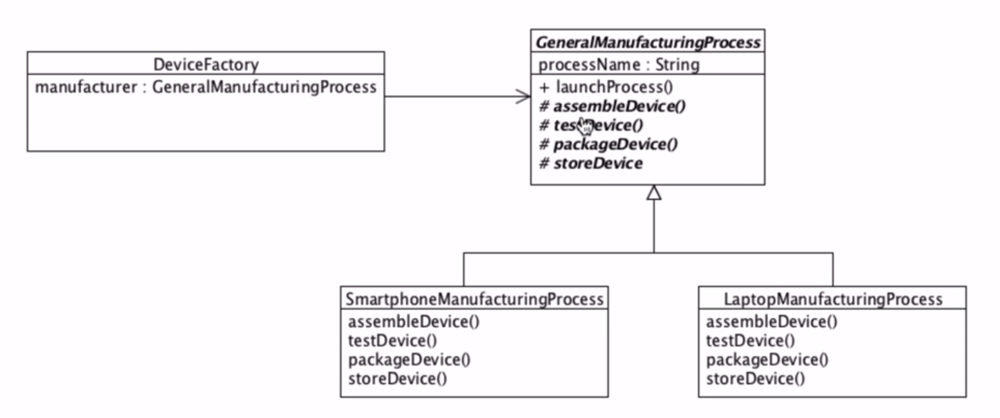

### Dependency Inversion/Template Pattern
The idea is to create abstractions first and then implement 
the lower level details.

So basically create an employee class first and then implement doctor,
nurse etc.
In the above example doctor and nurse are low level details and
employee is an abstraction.

In this example we implement a manufacturing processs. general manufacturing class is an
abstarction and the two classess Smartphone Manufacturing
and Laptop manufacturing implement it.

Abstract methods are written in italics and the # sign before them
indicates they are protected.

The protected keyword prevents member variables to be protected
from any thing other than a child class.

So if we want to give the client class(device factory) to have acccess
to all these abstract methods we can put them in the same package 
or make them public.

But if we want to hide the abstractions, and only expose the
non abstract method (launchProcess()) which essentially calls
the functions out in the correct order, we can make the non abstract method public
and put the client in a different package.

