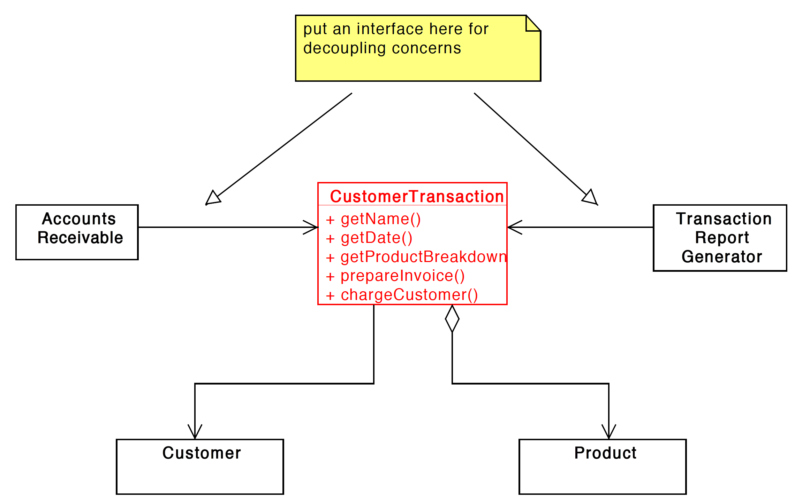

### Interface Segregration Principle
```text
Clients should not be forced to depend on methods
 that they do not use.
```

In this example the customer transaction implements multiple 
interfaces. The reason being the methods for A/C recievable 
should not affect Report Generator.

Hence the segregration of seperate interfaces to satisfy 
Single responsibilty principle.

Now any object created with Reporting interface need not
know about the methods or can't perform the methods by accounting interface.
Although both objects reporting and accounting are objects of class
cusotmer transaction.

