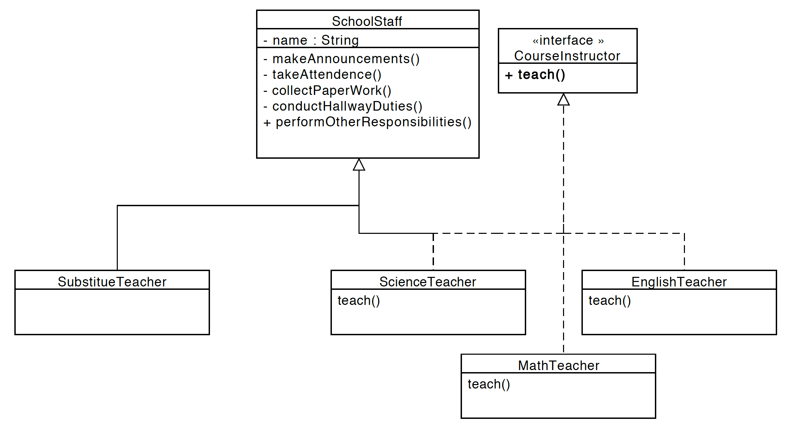

### Liskov Substitution Principle

The main idea behind this is
 ```text
 Objects should be replaceable with instances of
  their subtypes without altering the correctness 
  of that program

```



So in this ScienceTeacher, MathsTeacher, EnglishTeacher extend
the functionality of SchoolStaff class and inherit performOtherReponsibilities() 
function. Rest of the methods of the schoolstaff class are private.

So why not put teach() method in the SchoolStaff class because
there are other staff in school who are not teaching. For eg 
a substitute teacher may come in and perform all reponsibilties except Teaching.

That's why the course instructor interface is created so that the Science, maths and english teacher
can implement it.

Now we will have no problem replacing objects of SchoolStaff with either
of Science, Maths or a Substitute teacher.

