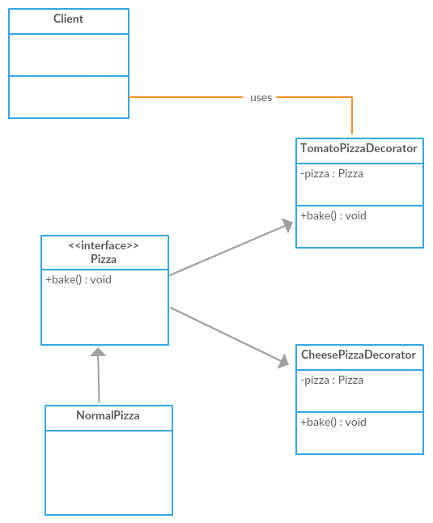

##### Decorator pattern
Design patterns offer us a fourth option that supports extending 
the functionality of an object dynamically (in runtime): Decorators.

A Decorator pattern can add responsibilities to an object dynamically,
and in a transparent manner (without affecting other objects) 

In this example
