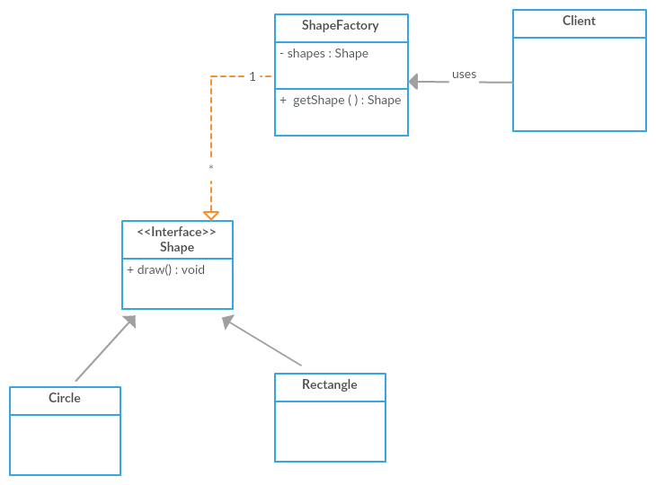

### FlyWeight Design pattern
Object-oriented systems can face performance issues due to the
overhead of object creation. Performance issues usually appear
in embedded systems with limited resources, such as smartphones and tablets.

The same problem can appear in large and complex systems are 
where we need to create a very large number of objects (and possibly users) 
that need to coexist at the same time.

the 3 steps we follow are:
1) seperate the extrinsic state(the member variables which are different for every instance)
2) pass them as parameters
3) create a factory class.

In the example both Circle and rectangle extend Shape(which is an abstract class).

#### Memory and performance consideration
This happens because whenever we create a new object, extra memory needs 
to be allocated. Although virtual memory provides us, theoretically, 
with unlimited memory, the reality is different. 

If all the physical memory of a system gets exhausted, 
it will start swapping pages to the secondary storage,
usually a Hard Disk Drive (HDD), which, in most cases, 
is unacceptable due to the performance differences 
between the main memory and HDD.
 
Apart from memory usage, performance is also a consideration. 
Graphics software, including computer games, should be able to render 
3D information (for example, a forest with thousands of trees or a village 
full of soldiers) extremely fast. 

If each object of a 3D terrain is created individually and no data sharing 
is used, the performance will be prohibitive.

The Flyweight design pattern is a technique used to minimize memory usage
 and improve performance by introducing data sharing between similar objects.
 
A Flyweight is a shared object that contains state-independent, 
immutable (also known as intrinsic) data.
  
The state-dependent, mutable (also known as extrinsic) data should not be
part of Flyweight because this is information that cannot be shared since
it differs per object. If Flyweight needs extrinsic data,
they should be provided explicitly by the client code.

In this example

#### Requirements

The Gang Of Four (GoF) book lists the following requirements that need to be satisfied
to effectively use the Flyweight Pattern:

• The application needs to use a large number of objects.

• There are so many objects that it's too expensive to store/render them. Once
the mutable state is removed (because if it is required, it should be passed
explicitly to Flyweight by the client code), many groups of distinct objects
can be replaced by relatively few shared objects.

• Object identity is not important for the application. We cannot rely on object
identity because object sharing causes identity comparisons to fail (objects
that appear different to the client code, end up having the same identity).

#### Real Life software application
An example might help to clarify how the Flyweight pattern can be practically used.
Let's assume that we are creating a performance-critical game, for example, a First-
Person Shooter (FPS). 

In FPS games, the players (soldiers) share some states, such as
representation and behavior. In Counter-Strike, for instance, all soldiers of the same
team (counter-terrorists versus terrorists) look the same (representation).
 
 In the samegame, all soldiers (of both teams) have some common actions, such as jump, duck,
and so forth (behavior). This means that we can create a Flyweight that will contain
all the common data. 

Of course, the soldiers also have many mutable data that are
different per soldier and will not be a part of the Flyweight, such as weapons, health,
locations, and so on.